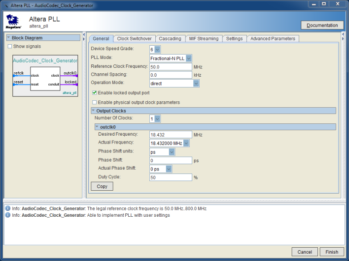

# Lab 7: Analyzer Project Guide
	
## Overview

The **Waveform Analyzer** captures data using the Audio Codec ADC then uses a [Fast Fourier Transform](https://en.wikipedia.org/wiki/Fast_Fourier_transform) (FFT) to determine the frequency components of the waveform.  The reference waveform signal comes from the [**Waveform Generator**](Lab7-ProjectGuide-Generator.md) over a standard 3.5mm audio cable connected to the Line-In connector.

The Altera MegaCore [FFT IP Core](ug_fft.pdf), configured for a 512-point FFT, extracts the frequency spectrum of the incoming waveform.  Two FFT cores are used to process data from both the left and right channels.

The LCD add-on board will be used to display the frequency spectrum of the two channels.  The LCD controller generates the LCD image on-the-fly avoiding the typical need for a large graphics frame buffer memory.  The following image shows a demo using a music sample reference.

:information_source: For independent testing, the input source can be generated using any audio device (such as a phone).  Tone generator apps for both iOS and Android are available.  The ADC data processing assumes a 0dB input so make sure the volume is turned up.

:warning: **WARNING:** The design includes an audio pass-thru so the Line-In signal retransmits on Line-Out.  It is possible to connect the Line-Out to a speaker or headset to hear the generated tones but the volume will be **VERY LOUD** so don't put the speakers near your ears.  The speakers could also be damaged depending on other amplification so don't hook up good speakers.

## Project Architecture

### System Clock

Two clock domains will be used in the project.  The Audio Codec requires an 18.432MHz reference clock and the LCD panel requires a 9MHz pixel clock (we'll double that to 18MHz as described below).

As in the previous lab, the 18.432MHz audio clock will be generated from the 50MHz clock using a hardware **Phase-Locked Loop** (PLL) provided by the FPGA.  The [**Altera PLL**](https://www.altera.com/content/dam/altera-www/global/en_US/pdfs/literature/ug/ug_altpll.pdf) (ALTPLL) IP Core allows access to the PLL hardware.

For the LCD, an 18MHz clock will be used to allow the LCD Controller State Machine to generate the 9MHz pixel clock as part of the interface protocol.  The 18MHz clock will be generated from the 50MHz clock using another hardware PLL.

:information_source: A PLL generates the output clock by multiplying the reference clock frequency then dividing that down to the target frequency.  The Alera PLL has multiple divider outputs so more than one clock frequency can be generated per PLL.  Unfortunately, the two frequencies needed for the lab, 18.432MHz and 18.000MHz, cannot be cleanly divided from the same multiplier frequency.  Luckily, the FPGA we're using has 6 PLLs so each clock output can have its own PLL.

The design will have two clock domains, the ***audio clock domain*** and the ***lcd clock domain***.  The data from the audio digitizer will be bridged from the _audio clock domain_ to the _lcd clock domain_ using a dual-port RAM.  

:information_source: The Altera M10K RAM has a true dual-port mode which uses separate clocks for each port.  Other FPGA vendors provide similar RAM structures.  The dual clocking allows the RAM to cleanly bridge clock domains (with a few caveats).

### WM8731 Audio Codec Module

The **WM8731 Audio Codec Module** has been reused from the previous lab with no significant functional changes and only minor configuration changes.  The codec samples both line-in audio channels at 48kHz.

1. The Configuration data loaded into the WM8731 chips was modified to adjust the ADC input volume from 0dB to +3dB.

### Audio Stream Spectrum Analyzer

The **Audio Stream Spectrum Analyzer** module processes the waveform data for a single channel.  The project uses two of these modules to process data for the left and right channels.

* The **Audio Stream Digitizer Module** stores the captured waveform data in a circular buffer, which is twice the Frame size (512 samples) to prevent buffer overruns.  
* The **Audio Stream Digitizer Sample Buffer** infers a dual-port RAM block for the circular buffer and keeps track of the *head* and *tail* memory address registers.  The *head* and *tail* registers will automatically increment the addresses when buffer data is written or read. 
* Once a full frames-worth of data has been queued in the circular buffer, the **Audio Stream Digitizer FFT Framer** burst-writes the full frame to the FFT.  The FFT takes 512 clock cycles to process the data.  Buffer overruns are not an issue since the FFT runs on the audio clock which is much faster than the 48kHz sampling rate.
* The **Audio Stream Digitizer FFT** module is generated using the FFT IP Core.  The core parameters are set for 512-point FFT with 16 bit input and output data. For each frame processed, the FFT outputs a set of 512 complex numbers.
* The **Audio Stream Digitizer Display Scaler** module converts the complex number results (consisting of real and imaginary components) into magnitude values.  The magnitude is computed by taking the square root of the sum of the squares of the real and imaginary components.

	m = sqrt( r2 + i2 )

	Ideally, the module would compute power in decibels instead which is more relevant for audio.  That formula would be:  

	p = 10 * log( r2 + i2 )

	Finally, the module scales the result data to fit the display screen.  The frame data is then output to the LCD Frame Buffer to be displayed on the LCD screen.

	:warning: NOTE: Some of these calculations are incomplete in the current project framework.  Feel free to modify the code to calculate more accurate results.

### LCD Display Interface

The LCD add-on board uses a [Sharp LQ043](LQ043T1DG03.pdf) display originally used by the Sony PSP.  The display resolution is 480 x 272 with a standard 24-bit RGB interface.

The **LCD RGB Display Interface** will update the display scanning each row starting from Row 0, Column 0 (top-left corner) down to Row 271, Column 479 (bottom-right corner).

Instead of using a large graphic frame buffer memory, the display data will be generated on-the-fly from the scaled waveform data stored in the **LCD Sample Buffer** memory.

The `LCD_RGB_Display_Interface` module implementation is part of the [**Generator Project**](Lab7-ProjectGuide-Generator.md#lcd-interface-state-machine) assignment.  After implementation, the module should be copied over for use with this project.

## Implementation Requirements

### Implementation Tasks Overview

* Top Level Instantiations
	* Add instantiation for `audio_codec_controller`
	* Add instantiation for `audio_stream_analyzer_lchan`
	* Add instantiation for `audio_stream_analyzer_rchan`
* Generate Altera PLL IP Cores
	* Generate PLL core for `AudioCodec_Clock_Generator`
	* Generate PLL core for `LCD_Clock_Generator`
* Reuse the `LCD_RGB_Display_Interface` module from the Generator Project.
* Implement the `Audio_Stream_Digitizer_FFT_Framer` State Machine

### Top Level Instantiations

1. Instantiate a **`WM8731_Audio_Codec_Module`** module named `audio_codec_controller` with the following port connections.

	| Parameter Port   | Value                   |
	|------------------|-------------------------|
	| `CLK_RATE_HZ`    | `AUD_CLK_RATE_HZ`       |
	| `I2C_BUS_RATE`   | `400`                   |
	| `DAC_DATA_WIDTH` | `ADC_DATA_WIDTH`        |
	| `POWER_ON_DELAY` | `WM8731_POWER_ON_DELAY` |

	| Signal Port        | Assignment        |
	|--------------------|-------------------|
	| `DAC_RCHAN_DATA`   | `adc_rchan_data ` |
	| `DAC_LCHAN_DATA`   | `adc_lchan_data ` |
	| `DAC_RCHAN_TRIG`   |                   |
	| `DAC_LCHAN_TRIG`   |                   |
	| `ADC_RCHAN_READY`  | `adc_rchan_ready` |
	| `ADC_RCHAN_DATA`   | `adc_rchan_data`  |
	| `ADC_LCHAN_READY`  | `adc_lchan_ready` |
	| `ADC_LCHAN_DATA`   | `adc_lchan_data`  |
	| `I2C_SCLK`         | `FPGA_I2C_SCLK`   |
	| `I2C_SDAT`         | `FPGA_I2C_SDAT`   |
	| `AUD_XCK`          | `AUD_XCK`         |
	| `AUD_BCLK`         | `AUD_BCLK`        |
	| `AUD_DACLRCK`      | `AUD_DACLRCK`     |
	| `AUD_DACDAT`       | `AUD_DACDAT`      |
	| `AUD_ADCLRCK`      | `AUD_ADCLRCK`     |
	| `AUD_ADCDAT`       | `AUD_ADCDAT`      |
	| `CLK`              | `aud_clk`         |
	| `RESET`            | `aud_reset`       |

	:warning: NOTE: The DAC Trigger ports are unused outputs so the port connections can remain blank.
	
	:information_source: The ADC input data is looped back to the DAC output data signals to create a Line-In to Line-Out passthrough.

1. Instantiate a **`Audio_Stream_Spectrum_Analyzer `** module named `audio_stream_analyzer_lchan ` with the following port connections.

	| Parameter Port   | Value                   |
	|------------------|-------------------------|
	| `CLK_RATE_HZ`    | `AUD_CLK_RATE_HZ`       |
	| `DATA_WIDTH`     | `ADC_DATA_WIDTH`        |
	| `FRAME_SAMPLES`  | `FFT_FRAME_SIZE`        |

	| Signal Port        | Assignment          |
	|--------------------|---------------------|
	| `ENABLE`           | `1'b1`              |
	| `ADC_CHAN_TRIG`    | `adc_lchan_ready`   |
	| `ADC_CHAN_DATA`    | `adc_lchan_data`    |
	| `LCD_FRAME_VALID`  | `frame_valid_lchan` |
	| `LCD_FRAME_START`  | `frame_start_lchan` |
	| `LCD_FRAME_END`    | `frame_end_lchan`   |
	| `LCD_FRAME_DATA`   | `frame_data_lchan`  |
	| `CLK`              | `aud_clk`           |
	| `RESET`            | `aud_reset`         |
	
1. Instantiate a **`Audio_Stream_Spectrum_Analyzer `** module named `audio_stream_analyzer_rchan ` with the following port connections.

	| Parameter Port   | Value                   |
	|------------------|-------------------------|
	| `CLK_RATE_HZ`    | `AUD_CLK_RATE_HZ`       |
	| `DATA_WIDTH`     | `ADC_DATA_WIDTH`        |
	| `FRAME_SAMPLES`  | `FFT_FRAME_SIZE`        |

	| Signal Port        | Assignment          |
	|--------------------|---------------------|
	| `ENABLE`           | `1'b1`              |
	| `ADC_CHAN_TRIG`    | `adc_rchan_ready`   |
	| `ADC_CHAN_DATA`    | `adc_rchan_data`    |
	| `LCD_FRAME_VALID`  | `frame_valid_rchan` |
	| `LCD_FRAME_START`  | `frame_start_rchan` |
	| `LCD_FRAME_END`    | `frame_end_rchan`   |
	| `LCD_FRAME_DATA`   | `frame_data_rchan`  |
	| `CLK`              | `aud_clk`           |
	| `RESET`            | `aud_reset`         |
	
	
### PLL Core Generation

Two Altera PLL IP Cores will be used in this design.  The core generation will use the same method as used in the previous lab.

1. Generate Audio Clock PLL

	The Audio Clock generates 18.432MHz from the 50MHz Reference Clock.
	
	1. Launch the **Altera PLL** IP Configurator from the IP Catalog.

	1. Name the **IP Variation** `AudioCodec_Clock_Generator` and select *Verilog*.

	1. Set the **PLL Mode** to *Fractional-N PLL*, the **Reference Clock Frequency** to 50.0MHz and the **Desired Frequency** to 18.432MHz.

		
		
	1. The default settings for the remaining tabs are fine so click the Finish button to generate the core.

	1. The provided framework code already has the **`AudioCodec_Clock_Generator`** instantiated in the **`System_Clock_Reset_Manager`** module so nothing else needs to be done for this design.

1. Generate LCD Clock PLL

	The LCD Clock generates 18.000MHz from the 50MHz Reference Clock.
	
	1. Launch the **Altera PLL** IP Configurator from the IP Catalog.

	1. Name the **IP Variation** `LCD_Clock_Generator` and select *Verilog*.

	1. Set the **PLL Mode** to *Integer-N PLL*, the **Reference Clock Frequency** to 50.0MHz and the **Desired Frequency** to 18.000MHz.

		
		
	1. The default settings for the remaining tabs are fine so click the Finish button to generate the core.

	1. The provided framework code already has the **`LCD_Clock_Generator `** instantiated in the **`System_Clock_Reset_Manager`** module so nothing else needs to be done for this design.

### LCD Interface State Machine

The **LCD RGB Display Interface** State Machine is implemented as part of the Waveform Generator Project.  Copy the completed `LCD_RGB_Display_Interface` module from the Generator Project to this project.

Add the following addition to the port definition list  `output reg [8:0] DATA_ROW_INV,`

To the RESET state in the state machine intialize the `DATA_ROW_INV` signal to `9'h000`

 In State S2, add the assignment `DATA_ROW_INV <= 9'd274 - vsync_pulse_counter[8:0];`
 

### Audio Stream Digitizer FFT Framer State Machine

The Sample Buffer and the FFT both have auto-increment data ports so, when the control signals are asserted, new data is read or written on every clock cycle. Therefore, the State Machine simply has to assert the proper control signals and count how long until the transfer completes.

#### State Machine Implementation

The `Audio_Stream_Digitizer_FFT_Framer` module provides a framework for the state machine implementation.  Implement the state machine with actions and transitions as described below.

* **Reset State**

	* Reset the Buffer Control Signals
		* Set `BUFFER_READ` low
	* Reset the Frame Control Signals
		* Set `FRAME_START`, `FRAME_END`, and `FRAME_VALID` low
		* Set `frame_count_reload` high to reload the counter
	* Set `State` to **S0**

* **State S0:** _Idle State_
	
	* **Actions:**

		* Clear Frame Signals
			* Set `FRAME_END` and `FRAME_VALID` low
		* Clear the Buffer Signals
			* Set `BUFFER_READ` low
		* Reload the Frame Counter
			* Set `frame_count_reload` high

	* **Transition:** When both `BUFFER_READY` and `FRAME_READY` are high, transition to **S1**.

* **State S1:** _Enable Frame Transfer_
	
	* **Actions:**

		* Start the Frame Transfer
			* Set `FRAME_VALID` high
			* Set `FRAME_START` high
		* Start the Buffer Read 
			* Set `BUFFER_READ` high
		* Start the Frame Counter
			* Set `frame_count_reload` low

	* **Transition:** Automatically transition to state **S2**.

* **State S2:** _Burst Data until Frame Done_
	
	* **Actions:**

		* Clear the Frame Start signal
			* Set `FRAME_START` low
		* On the last data transfer, signal the End of Frame			* When `frame_done` asserts, set `FRAME_END` high
		
	* **Transition:** When `frame_done` asserts, transition to state **S0**.

## Compiling / Simulating Project

There are a number of issues with building the project using Quarts 15.0.2.  

The FFT core may be either a time-limited OpenCore Plus Hardware Evaluation core or may pull a core license from the CWRU license server.

:warning: **WARNING:** There is a known bug with Quartus 15.0.2 where the Simulation Tool must be set to `<None>` before running the Compilation process when using a OpenCore Plus Hardware Evaluation core.

:warning: **NOTE:** The FFT adds enough code lines to put the project over the ModelSim Starter Edition limit.  The simulation time is greatly slowed down, making the simulation nearly useless.  It takes about an hour to simulate through a single FFT frame.

:warning: **NOTE:** When a design including an Evaluation core is loaded using the Programmer, a dialog box is shown which tethers the FFT core via JTAG while open.  If the dialog box is closed, the one hour timer for the core is started. 

:warning: **WARNING:** If the tether dialog box is left open during a compile, Quartus 15.0.2 will crash.

:warning: **NOTE:** The FFT IP Core adds a lot of logic to the design so expect longer build times for the project (~7 minutes).

:warning: **NOTE:** When using the OpenCore Plus Hardware Evaluation cores the name of the  programming file is modified with the `_time_limited` suffix.  The programming file generated for the lab will be named `EECS301_Lab7_Analyzer_TopLevel_time_limited.sof`.

## Reference Material

* [Lab 7: Analyzer Project Guide](Lab7-AnalyzerProjectGuide.md)
* [Wolfson WM8731 Audio Codec Datasheet](WM8731_v4.9.pdf)
* [Sharp LCD LQ043 Datasheet](LQ043T1DG03.pdf)
* [Altera FFT IP Core Datasheet](ug_fft.pdf)

---

Return to the [Lab 7 Assignment](../README.md) page...
