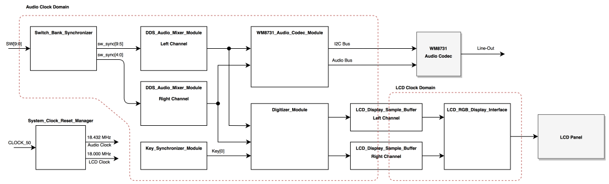
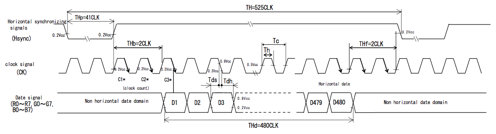

# Lab 7: Generator Project Guide
	
## Overview

The **Waveform Generator** uses the DDS and Audio Codec modules from previous labs to create two composite waveforms output on the left and right channels of the Line-Out connector.  The generated waveforms will be sent to the [**Waveform Analyzer**](Lab7-ProjectGuide-Analyzer.md) over a standard 3.5mm audio cable from the Line-Out connector.

The board switches determine the frequency content of each waveform channel, as was done for the previous lab.  There will be 5 options for each waveform: 1kHz, 3kHz, 5kHz, 7kHz and 10kHz.

The LCD add-on board will be used to display the generated waveforms.  The Digitizer module will capture waveform samples in a circular buffer and then update the LCD frame buffer with scaled display data.

The LCD controller will use the sampled data to generate the LCD image on-the-fly avoiding the typical need for a large graphics frame buffer memory.

## Project Architecture

### System Clocks

Two clock domains will be used in the project.  The Audio Codec requires an 18.432MHz reference clock and the LCD panel requires a 9MHz pixel clock (we'll double that to 18MHz as described below).

As in the previous lab, the 18.432MHz audio clock will be generated from the 50MHz clock using a hardware **Phase-Locked Loop** (PLL) provided by the FPGA.  The [**Altera PLL**](https://www.altera.com/content/dam/altera-www/global/en_US/pdfs/literature/ug/ug_altpll.pdf) (ALTPLL) IP Core allows access to the PLL hardware.

For the LCD, an 18MHz clock will be used to allow the LCD Controller State Machine to generate the 9MHz pixel clock as part of the interface protocol.  The 18MHz clock will be generated from the 50MHz clock using another hardware PLL.

:information_source: A PLL generates the output clock by multiplying the reference clock frequency then dividing that down to the target frequency.  The Alera PLL has multiple divider outputs so more than one clock frequency can be generated per PLL.  Unfortunately, the two frequencies needed for the lab, 18.432MHz and 18.000MHz, cannot be cleanly divided from the same multiplier frequency.  Luckily, the FPGA we're using has 6 PLLs so each clock output can have its own PLL.

The design will have two clock domains, the ***audio clock domain*** and the ***lcd clock domain***.  The data from the audio digitizer will be bridged from the _audio clock domain_ to the _lcd clock domain_ using a dual-port RAM.  

:information_source: The Altera M10K RAM has a true dual-port mode which uses separate clocks for each port.  Other FPGA vendors provide similar RAM structures.  The dual clocking allows the RAM to cleanly bridge clock domains (with a few caveats).

### Switch Bank Synchronizer

The **Switch Bank Synchronizer** module repackages the **`Debounce_Synchronizer`** module (from previous labs) providing a parameter to set the number of switch ports.  This provides a more flexible mechanism to use the slider switches on the development board.

:information_source: The **Switch Bank Synchronizer** module has a useful example of using the **generate** method to create variable instantiations based on parameters.

As can be seen on the architecture diagram, six switches are being utilized to control various aspects of the design.  The following table lists the function for each switch.

#### Switch Function Table

| Switch |                 Function                    |
|:------:|---------------------------------------------|
|  SW[0] | Enable Right Channel 1kHz Signal Generator  |
|  SW[1] | Enable Right Channel 3kHz Signal Generator  |
|  SW[2] | Enable Right Channel 5kHz Signal Generator  |
|  SW[3] | Enable Right Channel 7kHz Signal Generator  |
|  SW[4] | Enable Right Channel 10kHz Signal Generator |
|  SW[5] | Enable Left Channel 1kHz Signal Generator   |
|  SW[6] | Enable Left Channel 3kHz Signal Generator   |
|  SW[7] | Enable Left Channel 5kHz Signal Generator   |
|  SW[8] | Enable Left Channel 7kHz Signal Generator   |
|  SW[9] | Enable Left Channel 10kHz Signal Generator  |

### DDS Audio Mixer Module

The **DDS Audio Mixer** module mostly reuses code from the last lab with slight variations.  

1. The number of waveform components has been increased to 5 by adding two additional **DDS Modules**.
1. A gain factor has been added to the waveform mixer to produce full-scale output for any combination of DDS enables.

### WM8731 Audio Codec Module

The **WM8731 Audio Codec Module** has been reused from the previous lab with no significant functional changes and only minor configuration changes.

1. The Configuration data loaded into the WM8731 chips was modified to adjust the ADC input volume from 0dB to +3dB.

### Digitizer Module

The **Digitizer Module** captures the output waveform data to display on the LCD panel.  A circular buffer is used to store the sample data which allows for continuous sampling while the triggering mechanism handles framing the data for display.

The trigger mechanism looks for a rising zero crossing to center the display frame buffer.  A simplistic trigger model is used so the display may still jump between trigger points but mostly the same point of the waveform is found for each frame update.

:warning: NOTE: Automatic triggering is disabled so to trigger the digitizer either single-press or press-and-hold button KEY0.  The trigger button can be held down while changing switch inputs to immediately see the changes.

### LCD Display Interface

The LCD add-on board uses a [Sharp LQ043](LQ043T1DG03.pdf) display originally used by the Sony PSP.  The display resolution is 480 x 272 with a standard 24-bit RGB interface.

The **LCD Display Interface** will update the display scanning each row starting from Row 0, Column 0 (top-left corner) down to Row 271, Column 479 (bottom-right corner).

Instead of using a large graphic frame buffer memory, the display data will be generated on-the-fly from the scaled waveform data stored in the **LCD Sample Buffer** memory.

## Implementation Requirements

### Implementation Tasks Overview

* Top Level Instantiations
	* Add instantiation for `audio_left_channel_mixer`
	* Add instantiation for`audio_right_channel_mixer`
	* Add instantiation for`audio_codec_controller`
* Generate Altera PLL IP Cores
	* Generate PLL core for `AudioCodec_Clock_Generator`
	* Generate PLL core for `LCD_Clock_Generator`
* Implement the `LCD_RGB_Display_Interface` State Machine 

### Top Level Instantiations

The previous lab frameworks have included many examples module instantiations.  This lab requires hooking up a few of the framework modules at the top level.  The top level module `EECS301_Lab7_Generator_TopLevel` has place holder locations for the following instantiations.

:information_source: HINT: To reduce typing and avoid mistakes, copy the module definition block from the module file and paste it to start the instantiation, then edit for proper syntax and add the port connections.

1. Instantiate a **`DDS_Audio_Mixer_Module`** module named `audio_left_channel_mixer` with the following port connections.

	| Parameter Port  | Value  |
	|-----------------|--------|
	| `CLK_RATE_HZ`   | `AUD_CLK_RATE_HZ` |
	| `WF_INIT_FILE`  | `{SIM_PATH, "dds_sine_waveform.dat"}` |
	| `WF_ADDR_WIDTH` | `11` |
	| `WF_DATA_WIDTH` | `16` |
	
	| Signal Port        | Assignment       |
	|--------------------|------------------|
	| `ENABLE_1KHZ`      | `sw_sync[5]`     |
	| `ENABLE_3KHZ`      | `sw_sync[6]`     |
	| `ENABLE_5KHZ`      | `sw_sync[7]`     |
	| `ENABLE_7KHZ`      | `sw_sync[8]`     |
	| `ENABLE_10KHZ`     | `sw_sync[9]`     |
	| `DAC_MIXER_OUTPUT` | `dac_lchan_data` |
	| `CLK`              | `aud_clk`        |
	| `RESET`            | `aud_reset`      |
	
	:information_source: NOTE: The `WF_INIT_FILE` value uses the ***concatenate*** function to modify the path of the memory initialization file for simulation.  When launched, ModelSim sets its base path to the `/simulation/modelsim` directory.  Setting the `SIM_PATH` parameter in the Testbench file to `"../../"` properly corrects the path for the simulation.  For normal builds, the `SIM_PATH` is set to `""`.  Verilog-2001 does not have string variables so this parameter is handled as a packed array of 8-bit values.
	
	
2. Instantiate a **`DDS_Audio_Mixer_Module`** module named `audio_right_channel_mixer` using the same parameter port connections as the left channel and with the following signal port connections.

	| Signal Port        | Assignment       |
	|--------------------|------------------|
	| `ENABLE_1KHZ`      | `sw_sync[0]`     |
	| `ENABLE_3KHZ`      | `sw_sync[1]`     |
	| `ENABLE_5KHZ`      | `sw_sync[2]`     |
	| `ENABLE_7KHZ`      | `sw_sync[3]`     |
	| `ENABLE_10KHZ`     | `sw_sync[4]`     |
	| `DAC_MIXER_OUTPUT` | `dac_rchan_data` |
	| `CLK`              | `aud_clk`        |
	| `RESET`            | `aud_reset`      |

3. Instantiate a **`WM8731_Audio_Codec_Module`** module named `audio_codec_controller` with the following port connections.

	| Parameter Port   | Value                   |
	|------------------|-------------------------|
	| `CLK_RATE_HZ`    | `AUD_CLK_RATE_HZ`       |
	| `I2C_BUS_RATE`   | `400`                   |
	| `DAC_DATA_WIDTH` | `DAC_DATA_WIDTH`        |
	| `POWER_ON_DELAY` | `WM8731_POWER_ON_DELAY` |


	| Signal Port        | Assignment       |
	|--------------------|------------------|
	| `DAC_RCHAN_DATA`   | `dac_rchan_data` |
	| `DAC_LCHAN_DATA`   | `dac_lchan_data` |
	| `DAC_RCHAN_TRIG`   | `dac_rchan_trig` |
	| `DAC_LCHAN_TRIG`   | `dac_lchan_trig` |
	| `ADC_RCHAN_READY`  |                  |
	| `ADC_RCHAN_DATA`   |                  |
	| `ADC_LCHAN_READY`  |                  |
	| `ADC_LCHAN_DATA`   |                  |
	| `I2C_SCLK`         | `FPGA_I2C_SCLK`  |
	| `I2C_SDAT`         | `FPGA_I2C_SDAT`  |
	| `AUD_XCK`          | `AUD_XCK`        |
	| `AUD_BCLK`         | `AUD_BCLK`       |
	| `AUD_DACLRCK`      | `AUD_DACLRCK`    |
	| `AUD_DACDAT`       | `AUD_DACDAT`     |
	| `AUD_ADCLRCK`      | `AUD_ADCLRCK`    |
	| `AUD_ADCDAT`       | `AUD_ADCDAT`     |
	| `CLK`              | `aud_clk`        |
	| `RESET`            | `aud_reset`      |

	:warning: NOTE: The ADC ports are unused outputs so the port connections can remain blank.
	
### PLL Core Generation

Two Altera PLL IP Cores will be used in this design.  The core generation will use the same method as used in the previous lab.

1. Generate Audio Clock PLL

	The Audio Clock generates 18.432MHz from the 50MHz Reference Clock.
	
	1. Launch the **Altera PLL** IP Configurator from the IP Catalog.

	1. Name the **IP Variation** `AudioCodec_Clock_Generator` and select *Verilog*.

	1. Set the **PLL Mode** to *Fractional-N PLL*, the **Reference Clock Frequency** to 50.0MHz and the **Desired Frequency** to 18.432MHz.

		
		
	1. The default settings for the remaining tabs are fine so click the Finish button to generate the core.

	1. The provided framework code already has the **`AudioCodec_Clock_Generator`** instantiated in the **`System_Clock_Reset_Manager`** module so nothing else needs to be done for this design.

1. Generate LCD Clock PLL

	The LCD Clock generates 18.000MHz from the 50MHz Reference Clock.
	
	1. Launch the **Altera PLL** IP Configurator from the IP Catalog.

	1. Name the **IP Variation** `LCD_Clock_Generator` and select *Verilog*.

	1. Set the **PLL Mode** to *Integer-N PLL*, the **Reference Clock Frequency** to 50.0MHz and the **Desired Frequency** to 18.000MHz.

		
		
	1. The default settings for the remaining tabs are fine so click the Finish button to generate the core.

	1. The provided framework code already has the **`LCD_Clock_Generator `** instantiated in the **`System_Clock_Reset_Manager`** module so nothing else needs to be done for this design.

### LCD Interface State Machine

The LCD bus consists of four control signals (DISP, CK, HSYNC, VSYNC) and 24 RGB data signals. Control and data signals are updated on the rising edge of the 9 MHz clock signal (CK).  The horizontal (HSYNC) and vertical (VSYNC) synchronization signals set where the pixel data.  Pixel data for the entire display is written per frame.  

The HSYNC and VSYNC signals set where the pixel data is written on the display.  The display frame update starts at Row 0, Col 0 in the top-left corner, then writes the data out row-by-row.

The following diagrams detail the bus timing

These may seem like complicated timing diagrams but by taking note of the control signal interactions and structuring the input data buffers with the data flow

:information_source: The `HSYNC` and `VSYNC` signal timing will use rollover counters similar to the PWM counters used in previous labs.  In this case, the duty cycle timer can generate both the sync signal and the row and column pixel indexes.

#### State Machine Implementation

The `LCD_RGB_Display_Interface` module provides a framework for the state machine implementation.  Implement the state machine with actions and transitions as described below.

* **Reset State**

	* Idle the LCD Bus
		* Set `LCD_DISP` low
		* Set `LCD_CK` low
		* Set `LCD_HSYNC` high
		* Set `LCD_VSYNC` high
		* Set `LCD_R`, `LCD_G` and `LCD_B` low (for Black)
	* Set `DATA_SOF` low
	* Set `DATA_COL` to zero
	* Set `DATA_ROW` to zero
	* Set `hsync_line_start` and `vsync_frame_start` low

	* Initialize counter registers
		* Set `hsync_interval_counter` to `HSYNC_INTERVAL_LOADVAL`
		* Set `hsync_pulse_counter` to `HSYNC_PULSE_LOADVAL`
		* Set `vsync_interval_counter` to `VSYNC_INTERVAL_LOADVAL`
		* Set `vsync_pulse_counter` to `VSYNC_PULSE_LOADVAL`
	
	* Set `State` to **S0**

* **State S0:** Idle State
	
	* **Actions:**

		* Set `DATA_SOF` low to clear the Start of Frame signal
		
		* Set `hsync_line_start` and `vsync_frame_start` high to force the counters to reload after enabled.
		
		* Idle the LCD Bus
			* Set `LCD_DISP` low
			* Set `LCD_CK` low
			* Set `LCD_HSYNC` high
			* Set `LCD_VSYNC` high
			* Set `LCD_R`, `LCD_G` and `LCD_B` low (for Black)
	
	* **Transition:** If Enabled, transition to **S1**.
	
* **State S1:** Pixel Clock Falling-Edge
	
	* **Actions:**

		* Set `LCD_CK` low (for falling edge)

		* When `hsync_line_start` is high, reload `hsync_interval_counter` with `HSYNC_INTERVAL_LOADVAL`, otherwise increment the counter.

		* When `hsync_line_start` is high, reload `hsync_pulse_counter` with `HSYNC_PULSE_LOADVAL`, otherwise increment the counter.

		* When `vsync_frame_start` is high, reload `vsync_interval_counter` with `VSYNC_INTERVAL_LOADVAL`, otherwise when `hsync_line_start` is high, increment the counter.

		* When `vsync_frame_start` is high, reload `vsync_pulse_counter` with `VSYNC_PULSE_LOADVAL`, otherwise when `hsync_line_start` is high, increment the counter.
		
		* When `vsync_frame_start` set `DATA_SOF` high, otherwise set `DATA_SOF` low.
	
	* **Transition:** If Enabled, transition to **S2**, otherwise transition to state **S0**.

* **State S2:** Pixel Clock Rising-Edge
	
	* **Actions:**

		* Set `LCD_CK` high (for rising edge)
		* When `vsync_interval_tick` is high, set `LCD_DISP` to `DISP_ENABLE` to synchronize the display enable with the start of a frame.
		* Output the Sync Outputs
			* Set `LCD_HSYNC` to `hsync_pulse_active`
			* Set `LCD_VSYNC` to `vsync_pulse_active & ~vsync_interval_tick`
		* Output Data During Active Phases
			* Set `LCD_R` to `(hsync_pulse_active & vsync_pulse_active) ? DATA_R : 8'h00`
			* Set `LCD_G` to `(hsync_pulse_active & vsync_pulse_active) ? DATA_G : 8'h00`
			* Set `LCD_B` to `(hsync_pulse_active & vsync_pulse_active) ? DATA_B : 8'h00`
		* Set Counter Rollover Flags
			* Set `hsync_line_start` to `hsync_interval_tick`
			* Set `vsync_frame_start` to `vsync_interval_tick`
		* Set the Pixel Index
			* Set `DATA_COL` to `hsync_pulse_counter[8:0]`
			* Set `DATA_ROW` to `vsync_pulse_counter[8:0]`
	
	* **Transition:** Automatically transition to state **S1**.
	

## Reference Material

* [Lab 7: Analyzer Project Guide](Lab7-AnalyzerProjectGuide.md)
* [Wolfson WM8731 Audio Codec Datasheet](WM8731_v4.9.pdf)
* [Sharp LCD LQ043 Datasheet](LQ043T1DG03.pdf)

---

Return to the [Lab 7 Assignment](../README.md) page...
