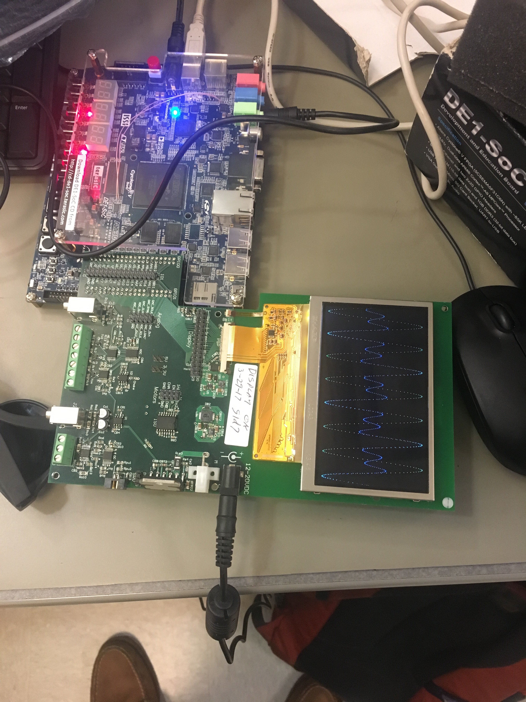

# EECS301 Lab #7  Final Report

**Nate Lundie and Anna Burkhart (ngl8@case.edu, alb171@case.edu)**

## Lab 7 - Generator

## Introduction
In this section of the lab, we used the DDS module and Audio codec from previous labs to createa a waveform and send it over an audio cable to a development board running the analyzer projected discussed later in this report. 

## Implementation Details
Like previous labs dealing with audio, we needed to create a 18.432 MHz clock, but this time we additionally needed an 18 MHz clock for the display. The biggest component of this sectionw as creating the LCD RGB Display Interface State Machine, which was re-used in the analyzer project as well. The state machine had 3 active states and a reset state, their functionality is described below.    

* **Reset:** While the reset signal is asserted, all counters are set to their load values, all active high signals are set low, and all active low signals are set high. Additinally, the state variable is set to S0.   

* **S0:** This is the idle state, while we await the enable signal. First we cleared DATA_SOF so that the initial image on screen is a blank frame. We then set hsync\_line\_start and vsync\_line\_start high so the counters are reloaded once the enable signal arrives. We then set all of the LCD bus signals to their idle states as described in the lab. If the enable signal is asserted, we transition to S1, if not we stay in S0.   
 
* **S1:** This is the state for the falling edge of the Pixel clock. Due to that, we first set LCD\_CK low  
**hsync\_interval\_counter:** if hsync\_line\_start is high, set to its loadval, otherwise increment it  
**hsync\_pulse\_counter:** if hsync\_line\_start is high, set to its loadval, otherwise increment it  
**vsync\_interval\_counter:** if vsync\_frame\_start is high, set to its loadval, otherwise if hsync\_line\_start is high, increment it.  
**vsync\_pulse\_counter:** if vsync\_frame\_start is high, set to its loadval, otherwise if hsync\_line\_start is high, increment it.  
**DATA\_SOF:** if vsync\_frame\_start is high, set DATA\_SOF high, otherwise set it low.  
**Transition:** If enabled, go to S2, if not go to S0.  
  
* **S2:** This is the state for the rising edge of the Pixel clock, as such we first set LCD\_CK high. If vsync\_interval\_tick is high, set LCD\_DISP to DISP\_ENABLE to make the display enable at the start of a frame. We then set the Vsync and Hsync based on whether there was an active pulse on their controlling signals. We then set the red, green and blue values for the LCD to either the data input if hsync\_pulse\_active and vsync\_pulse\_active were high and to zero otherwise. We set the counter rollovers to the interval tick signals. We then set the pixel index in terms of column and row.   
**Transition:** Autmatically transitioned to S1. 

## Verification Results
Here is a photo of the Generator project running on a board with the switches set as described in the report section on github:  

## Conclusions
This section of the lab introduced us to interfacing with an LCD screen and exporting a waveform over the audio jack. The LCD portion was especially important becuase it was re-used in the next part of the lab. 

## Lab 7 - Analyzer

## Introduction
The analyzer section of this lab was responsible for interpreting the waveforms from the Generator and then producing the frequency spectrum of the waves which was then visible on the LCD display.

## Implementation Details
The waveforms in this lab are examined using the Audio Codec ADCs, which required a 18.432MHz reference clock. On our part, the Audio Codecs were implemented in the WM8731_Audio_Codec_Module module and the Audio_Stream_Spectrum_Analyzer modules.
We then generated the Audio Clock PLL which was similar to the implementation used in Lab6 and LCD Clock PLL. This section of the lab also used the Generator section's LCD Interface State Machine with some slight modifications for the Analyzer to function correctly.
Finally, the Analyzer was implemented using the Audio Stream Digitizer FFT Framer State Machine, which was responsible for recognizing when the control signals were enabled and recording how long each transfer took to complete after the signal was asserted.
Some specifications of the state machine are outlined here, but the full implementation is included in the final submission of our project code:

* **Reset:** Resets the Buffer Control Signals and Frame Control Signals while setting the frame\_count\_reload high to reload the counter.  
**Transition:** Sets the State to Idle State S0 after the signals are reset and counter is reloaded.

* **S0:** Clears the Frame Signals and Buffer Signals and reloads the frame counter.  
**Transition:** Transitions to S1 if BUFFER\_READY and FRAME\_READY are both high.

* **S1:** The Enable Frame Transfer State setting the Frame Transfer signals and the Buffer Read signal to high and loading the frame counter to low.  
**Transition:** Automatically transitions to S2.

* **S2:** Bursts the Data until the Frame is done by clearing the Frame Start signal and setting FRAME\_END to high when frame\_done asserts.  
**Transition:** After frame\_done is asserted, transitions to S0.

## Verification Results
The two videos required for this portion of the lab were uploaded to Nate's Google Drive folder

## Conclusions
The Analyzer implementation as well as the implementation of both parts of this lab worked as expected and we verified the results using the LCD display and playing a song which registered all of the frequencies on the board. Additionally we worked well together as a group. 
