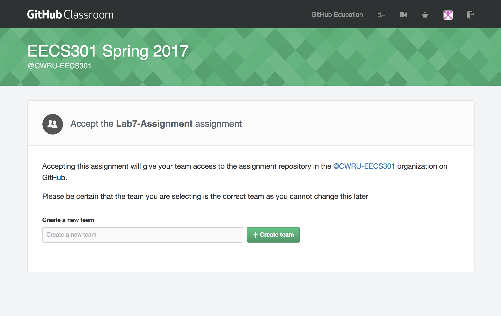
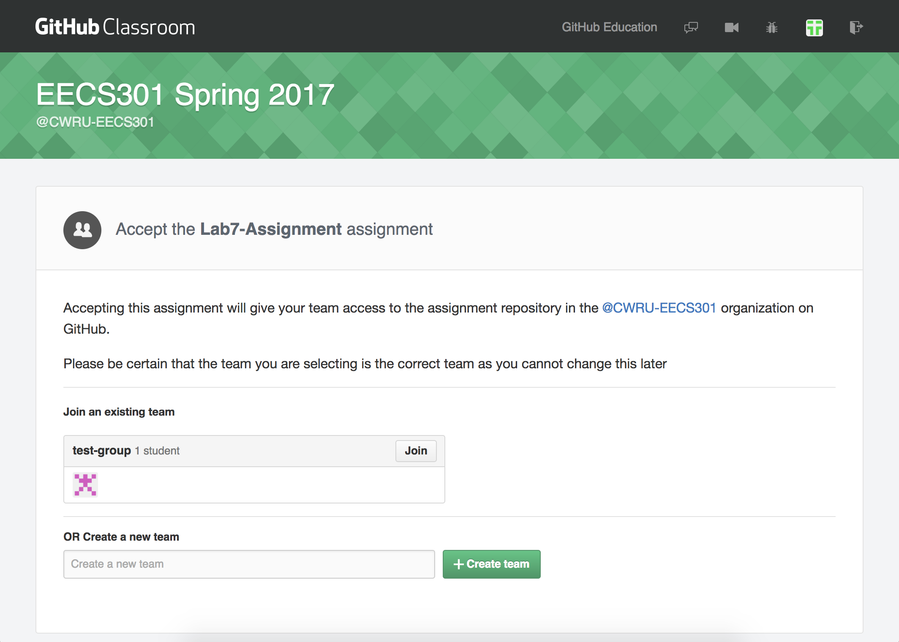

# Lab 7: Assignment

## Objective

The final lab will be a two person group project. Each group should have two development boards with LCD add-on boards. One development board will be configured as a signal generator and the other board will be configured as a spectrum analyzer.  The two boards will be connected via the Line-Out and Line-In connectors.

Two Quartus design projects, one for each development board, will be created for the lab.  Both projects will reuse components from previous labs, such as the Switch Synchronizer, DDS Audio Mixer and Audio Codec Module.

The [Generator Project](Lab7-Guide/Lab7-ProjectGuide-Generator.md) will be an expanded version of the previous lab.  Waveforms will be generated for both left and right Line-Out channels.  The Audio Mixer will have 5 tone frequencies to select for each channel.  A digitizer and LCD display controller has been added to capture generated waveforms and display the waveform on the LCD panel.

The [Analyzer Project](Lab7-Guide/Lab7-ProjectGuide-Analyzer.md) will capture the generated waveforms on the Line-In port using the Audio Codec ADCs.  The captured waveform data will be run through an FFT module and the resulting frequency spectrum will be displayed on the LCD panel.

The group can allocate design work as needed.  The two projects could make it easier to divide work but there are components used in both designs so sharing work between project would be more efficient.

## Assignment Overview

### Assignment Repository

An e-mail with the **Lab 7 Assignment Invitation Link** should have been received, if not, contact an instructor.  The Invitation Links will work slightly differently for this lab since it's a group project.  

1. One member of the group should open the Invitation Link to accept the assignment.  The first member of the group will create a **Team Name** for the group.

	:warning: Please name the team so both members are recognized in the name as you see fit.

	

	This will create a new private GitHub repository labeled with your **Team Name** (***lab7-assignment-teamname***).  You can now use the repo as you've done in previous labs.
	
1. Now, the second group member can open the Invitation Link and select to join the existing team.

	:warning: **WARNING:** Please make sure you're joining the proper team.

	:warning: **NOTE:** The first member of a new team may also see this screen due to other groups already creating their team.

	

Both group members will have access to the same GitHub repository.  Code can be shared through GitHub by committing then pushing and pulling changes.   Be careful about editing the same repo files because merge conflicts will occur and will need to be resolved.  This commonly occurs in large projects so it can usually be easily handled.

* The Lab 7 Assignment repository can be found here: [GitHub EECS301](https://github.com/CWRU-EECS301) 
* Clone the ***lab7-assignment-groupname*** repository to your development machine.

:information_source: **NOTE:** The GitHub website can be used to read through the lab documentation, guides, and instructions.  This can be easier if your development machine does not have a good Markdown viewer.

### Generate the Quartus Projects

For this lab, two Quartus Projects will be created.

1. The **Generator Project** will be called **`EECS301_Lab7_Generator_Project`** and will be generated using the same procedure as the previous labs but using the new set of files provided in the ***Lab7-GeneratorProject*** directory.

	:warning: Be sure to create the Quartus project in the ***Lab7-GeneratorProject*** directory, and be sure to set the top level file to **`EECS301_Lab7_Generator_TopLevel`**.

1. The **Analyzer Project** will be called **`EECS301_Lab7_Analyzer_Project`** and will be generated using the same procedure as the previous labs but using the new set of files provided in the ***Lab7-AnalyzerProject*** directory.

	:warning: Be sure to create the Quartus project in the ***Lab7-AnalyzerProject*** directory, and be sure to set the top level file to **`EECS301_Lab7_Analyzer_TopLevel`**.

	:warning: A pre-generated **FFT IP Core** has been provided with the project framework (hopefully to avoid the IP issues seen in the previous lab).  To include the IP core in the project make sure add these files to the project.
	
	* `Audio_Stream_Digitizer_FFT/synthesis/Audio_Stream_Digitizer_FFT.qip`
	* `Audio_Stream_Digitizer_FFT/simulation/Audio_Stream_Digitizer_FFT.sip`

:warning: Be sure to import the pin assignments from the `EECS301_Lab7_Project_Pins.csv` file for both projects.

### Implementation

There are two implementation guides for the lab.

* See the [Lab 7 Generator Project Guide](Lab7-Guide/Lab7-ProjectGuide-Generator.md) for Generator implementation details.

* See the [Lab 7 Analyzer Project Guide](Lab7-Guide/Lab7-ProjectGuide-Analyzer.md) for Analyzer implementation details.

### Verification

There are testbench files included with the project framework but the Analyzer Project exceeds the code limit for the ModelSim Starter Edition so it is very limited in its usefulness.

### LCD Hardware Add-on

The lab requires the LCD Add-on board.

:warning: **WARNING:** There is a known issue where the LCD display will turn white and be unresponsive.  Unplugging and replugging the power to the LCD board may fix the problem but the cause of the problem is unknown.

There is a test image (`LCD_Test_TopLevel.sof`) that can be used to verify if the LCD is working properly in the `LCD_Test_Project` directory of the project repo.  The image can be loaded using the Quartus Programmer.  Directions for the switch controls are documented in the [README.md](LCD_Test_Project/README.md).

## Report Requirements

The **Lab7-Report** directory contains a Markdown file `README.md` which is the main report document.  Any additional Markdown documents, images, or other documentation in the **Lab7-Report** directory should be referenced in the `README.md` document.

There will be two sections in this Lab 7 report - one for the Generator section and one for the Analyer section. Still just the one total report per group though.

### Report Requirements - Generator

1. The report should briefly describe the implementation details of the **LCD RGB Display Interface** State Machine.  What is it doing?

2. Take photos of the LCD displays for the following configuration:

	| Config | SW9 | SW8 | SW7 | SW6 | SW5 | SW4 | SW3 | SW2 | SW1 | SW0 | Description |
	|:------:|:---:|:---:|:---:|:---:|:---:|:---:|:---:|:---:|:---:|:---:|:------------|
	|   #1   |  0  |  0  |  0  |  1  |  0  |  0  |  0  |  1  |  1  |  1  | 3kHz Left, [1,3,5]kHz Right  |

### Report Requirements - Analyzer

1. The report should briefly describe the implementation details of the **Audio_Stream_Digitizer_FFT_Framer** State Machine.  What is it doing?

2. Take a video of the different modes of operation as described in the grading rubric for this section.

3. Include discussions about any changes you made to the calcuation of the amplitudes of the FFT spectrum bars that were not originally in the lab.  Is the displayed data what you really want to see for audio analysis (i.e. 10*log(Power@freq_of_interest)?  What would it take to really get this displayed?

4.  Your general impressions on this lab in general - was it to easy, to complicated, etc.  Any suggestions for improvemnets glady accepted here (i.e. there are no wrong answers in this section).

## Lab Assignment Due Date

The lab report submission will be due Tuesday 5/02/2017 by midnight. (Given the time crunch status, it's about as late as I can push it).  So nothing will be accepted with a time stamp of 05/03/2017 or later.  Sorry, NO exceptions as I have to create grades and get them out.  Simply stated ---- YOU DON'T want to miss 370 points.....

All files and code should be committed and pushed to GitHub by the submission deadline.  The report should also be submitted to Canvas as well.

## Grading Rubric for Final Lab 7 

## TOTAL Overall Grade is worth 370 Points

* All grading based on successful completion of ALL the assigned sub-sections in both halves of the lab:

## Lab 7 "Generator" Section is worth a total of 120 points

* 10 points for correctly instantiation for audio_left_channel_mixer
* 10 points for correctly instantiation for audio_right_channel_mixer
* 10 points for correctly instantiation for audio_codec_controller
* 10 points for correctly Generating a PLL core for the AudioCodec_Clock_Generator (using the IP library)
* 10 points for correctly Generating a PLL core for the LCD_Clock_Generator (using the IP library)
* 50 points for correctly Implement the LCD_RGB_Display_Interface State Machine
* 5 points for completed Generator Lab report in correct format (.md) submitted into GITHUB repo
* 5 points for Generator report in PDF format (Both on Canvas AND on GITHUB)

* Then:
* 10 points for the picture of the assigned screen/switch setting (described above) showing both the screen image and SW/LEDs in the picture.  Be sure the LCD image is clean and not masked by a reflection off of the LCD glass.

## Lab 7 "Group Cooperation" -- Section is worth a total of 100 points
* (I didn't KILL my lab partner - REALLY!) [NO surprise, but this SHOULD be a 'freebie' for all the lab groups]

## Lab 7 "Analyzer" Section is worth a total of 150 points

* 10 points for correctly instantiation for audio_codec_controller
* 10 points for correctly instantiation for audio_stream_analyzer_lchan
* 10 points for correctly instantiation for audio_stream_analyzer_rchan
* 10 points for correctly Generating a PLL core for the AudioCodec_Clock_Generator (using the IP library)
* 10 points for correctly Generating a PLL core for the LCD_Clock_Generator (using the IP library)
* 10 points for corrrectly instantiating the Reuse the LCD_RGB_Display_Interface module
* 40 points for correctly Implementing the Audio_Stream_Digitizer_FFT_Framer State Machine
* 5 points for completed Analyzer Lab report in correct format (.md) submitted into GITHUB repo
* 5 points for report in PDF format (Both on Canvas AND on GITHUB)

* 20 points for a video showing  the 2 DE1-SoC boards (w/LCDs) running both halves of the project [connected together with the 1/8" stereo cable] and starting with all switches down on the Generator (and updating the Generator display w/KEY[0] press[s], start with SW[0] and turn on 1 by 1 in this sequence: None-0-5-1-6-2-7-3-8-4-9 (shutting off the previously turned-on SW's so there is only 1 on at a time) working all the way up to the last SW[9] showing the LCD outputs on both systems (video includes Waveforms sent on generator, FFT results on Analyzer).  So there will be a total of 11 different 'modes' you will be filming.  You can be 'creative' with the narration.  

* Then - the GRAND FINALE' :
* 20 points for a video of the Analyzer display with you playing music of your choice (and speakers hooked to the green audio out jack on the analyzer board so the video can pick up the audio being pumped into the analyzer - see Prof JG for a set of amplified speakers if you don't have accesss to them) showing that ALL the spectrum segments do indeed work.  [A small challange in itself because the music chosen has to have content in all frequency ranges that the analyzer looks at on both left and right channels]

## Reference Material

